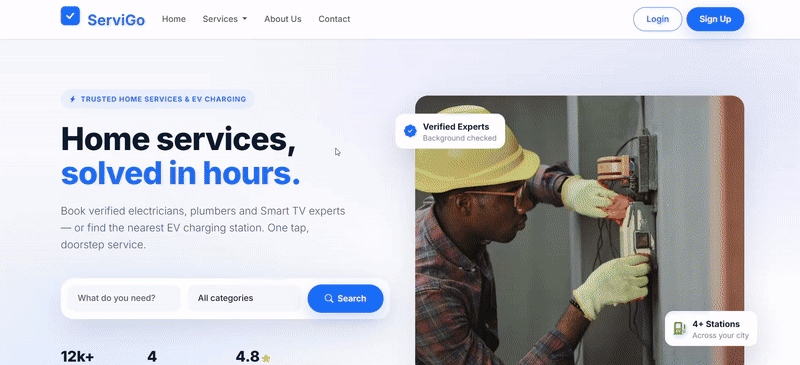
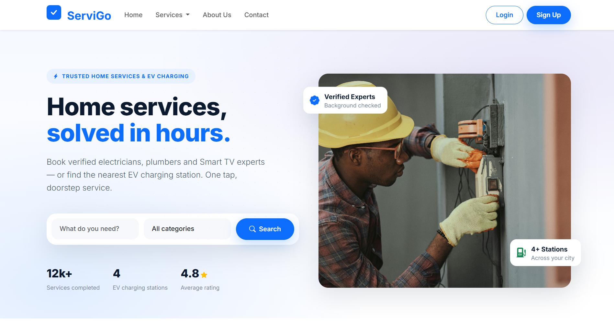
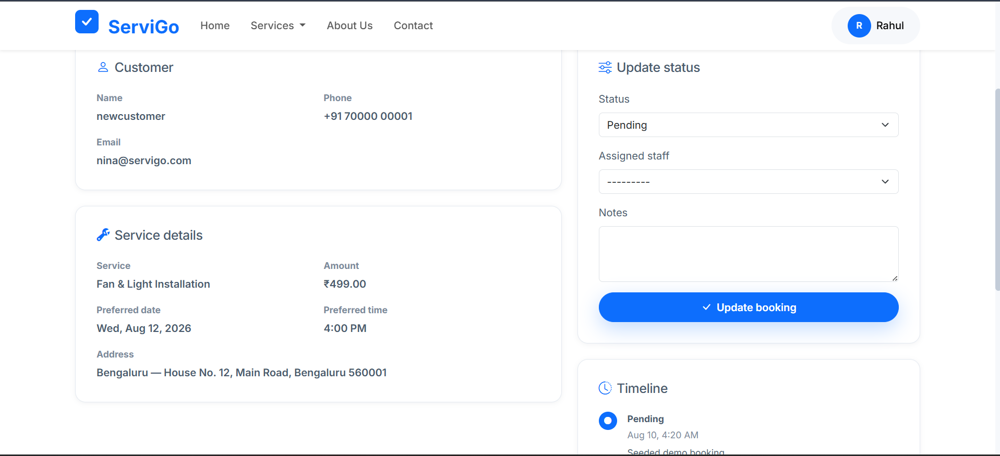
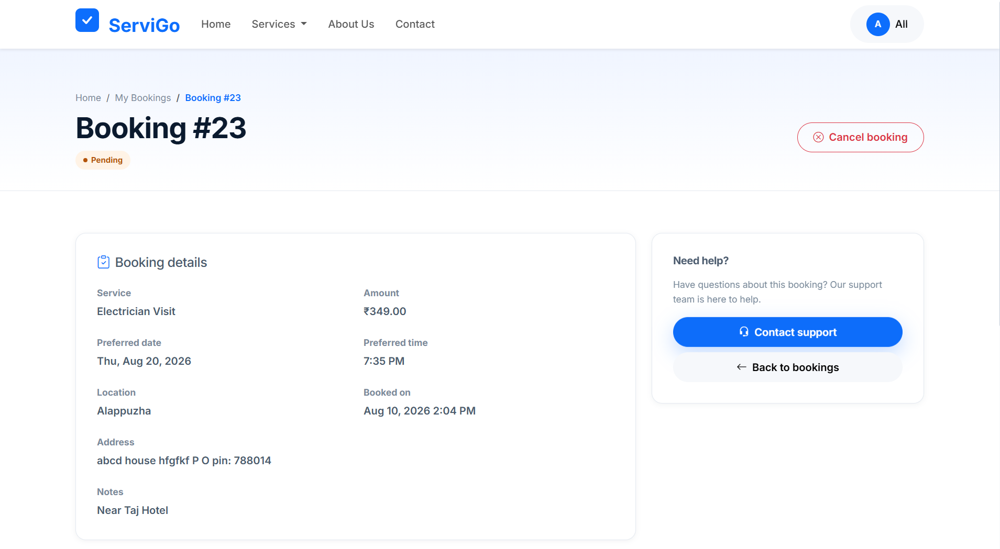
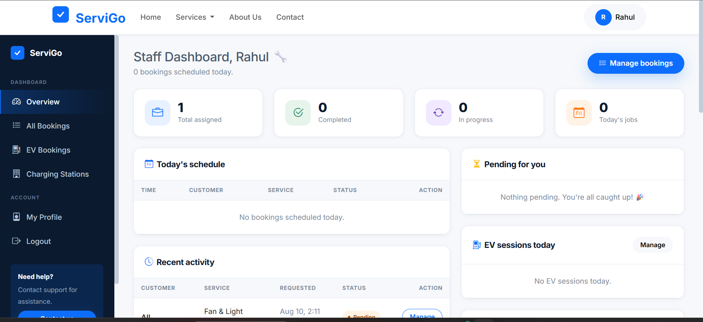
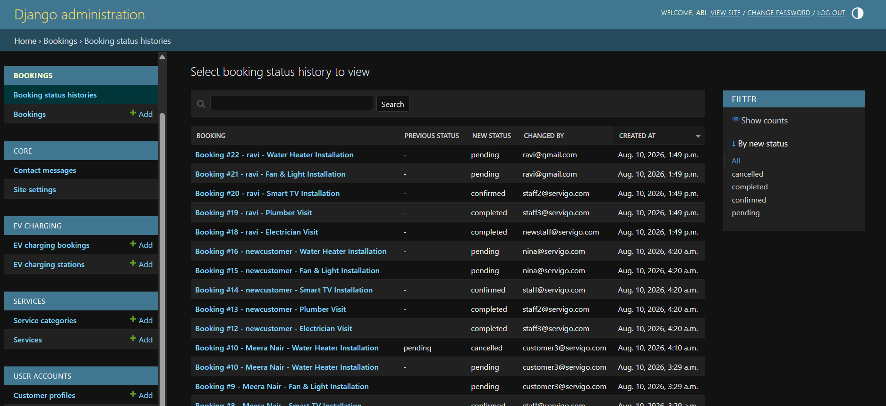
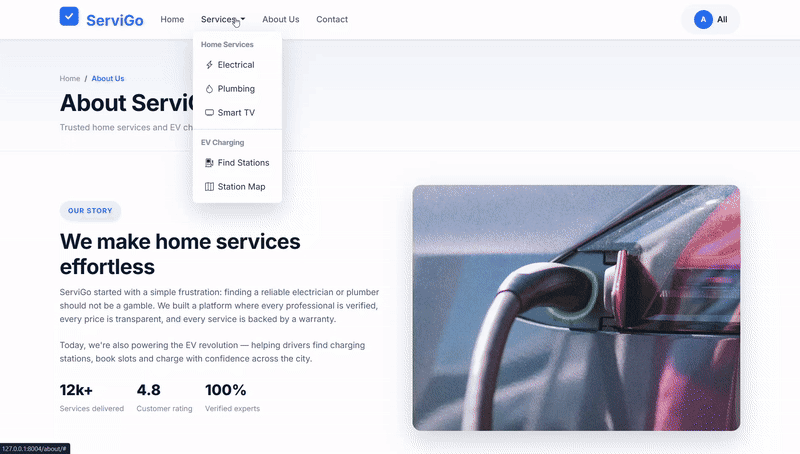

<div align="center">

# ☑️ ServiGo

### Home Services & EV Charging Booking Platform

A full-featured web application that connects customers with verified local service professionals — electricians, plumbers, and Smart TV experts — alongside a live network of EV charging stations with slot booking. Built on **Django 5.2** with role-based dashboards for customers, staff, and administrators.


</div>

<p align="center">
  
</p>

---

## 📖 Project Overview

ServiGo simplifies the way people manage home maintenance and electric vehicle charging — through a single, user-friendly platform.

Customers can quickly book professional services such as electrical repairs, plumbing, and Smart TV maintenance, or reserve a slot at a nearby EV charging station. Staff and administrators get powerful tools to manage bookings, services, customers, and operational workflows — all from dedicated role-based dashboards.

Built with Django and Bootstrap 5, ServiGo focuses on usability, security, and maintainability while demonstrating a practical implementation of authentication, CRUD operations, email notifications, role-based access control, and responsive web design.

---

## ✨ Key Features

| Area | Feature | What it does |
| ---- | ------- | ------------ |
| 🔐 **Authentication** | Secure registration & login | Email-or-username login with a custom `User` model (email as the unique identifier) |
| 🔐 **Authentication** | Role-based access | Customers, staff, and administrators each get their own portal and permissions |
| 🔐 **Authentication** | Password reset | Self-service recovery via email |
| 🛠️ **Services** | Service catalogue | Browse electrical, plumbing, and Smart TV services with detailed pricing |
| 🛠️ **Services** | Category pages | Dedicated pages per service category |
| 📅 **Bookings** | Service booking flow | Date, time, location and notes with a live price summary |
| 📅 **Bookings** | Email confirmation | Customers receive booking confirmations by email |
| 📅 **Bookings** | Status workflow | Pending → Confirmed → Completed (or Cancelled) with audit history |
| ⚡ **EV Charging** | Station search | Find stations by name, address, city, state, or pincode |
| ⚡ **EV Charging** | Filters | Charger-type and price filters plus an available-only toggle |
| ⚡ **EV Charging** | Slot booking | Reserve charging slots with Google Maps location integration |
| 📊 **Dashboards** | Customer dashboard | Upcoming service and EV bookings at a glance |
| 📊 **Dashboards** | Staff dashboard | Today's bookings and operational workload |
| 📊 **Dashboards** | Admin dashboard | Full-platform stats with recent service and EV bookings |
| 📧 **Contact** | Contact form | Inquiry form with email notifications |

---

## 👤 User Roles

| Role | What they can do |
| ---- | ---------------- |
| **Customer** | Browse services and EV stations, book appointments, manage their own bookings, and view booking history |
| **Staff** | View and manage service bookings, update booking statuses, and monitor daily service operations |
| **Admin** | Full administrative control — manage users, services, stations, bookings, and view platform-wide analytics |

> **Note:** Only `customer` and `staff` can self-register through the public form. Admin accounts are created only via `seed_demo` or the Django admin panel — preventing self-service privilege escalation.

---

## 🛠️ Technology Stack

| Category | Technologies |
| -------- | ------------ |
| **Backend** | Python 3.12, Django 5.2 |
| **Frontend** | HTML5, CSS3, Bootstrap 5, JavaScript |
| **Database** | SQLite (development) · PostgreSQL (production, via `DATABASE_URL`) |
| **Authentication** | Custom `User` model · email-or-username backend |
| **Forms** | Django Crispy Forms · Crispy Bootstrap 5 |
| **Configuration** | django-environ (environment variables) |
| **Media / Assets** | Pillow, Django static & media handling |
| **Dev Tooling** | django-browser-reload |
| **Deployment Ready** | Virtual environments, `.env` configuration |

---

## 🔄 Core Workflows

```text
                Client Browser
                      │
                      ▼
           Bootstrap 5 Responsive UI
                      │
                      ▼
              Django URL Routing
                      │
                      ▼
             Django Views & Logic
      ┌───────────────┼────────────────┐
      ▼               ▼                ▼
 Authentication  Booking Module   EV Charging
      │               │                │
      └───────────────┼────────────────┘
                      ▼
                SQLite / PostgreSQL
                      │
                      ▼
            Email Notifications
```

**Service booking flow**

```text
Browse Services → Select a Service → Fill Date/Time & Location
    → Book → Confirmation Email → Track Status in Dashboard
```

**EV charging flow**

```text
Search Stations → Filter by Location/Charger/Price → View Station Details
    → Pick a Slot → Confirm → Manage Booking in Dashboard
```

---

## 📸 Screenshots

### 🏠 Landing Page
<p align="center">
  
  <br>
  <em>Home page — hero, search, and featured services</em>
</p>

### 🔐 Authentication
<p align="center">
  
  
  <br>
  <em>Secure login and role-based registration</em>
</p>

### 📝 Service Booking
<p align="center">
  
  <br>
  <em>Schedule a visit — date, time, location, and booking summary</em>
</p>
<p align="center">
  
  
  <br>
  <em>Booking confirmation and detailed booking view</em>
</p>

### ⚡ EV Charging
<p align="center">
  
  
  <br>
  <em>Station details and charging slot booking</em>
</p>

### 👨‍💼 Staff Dashboard
<p align="center">
  
  
  <br>
  <em>Operational overview and booking management</em>
</p>

### 🛡️ Admin Panel
<p align="center">
  
  <br>
  <em>Booking status histories in the Django admin</em>
</p>

### 📧 Contact & About
<p align="center">
  
  
  <br>
  <em>Contact form and about page</em>
</p>

---

## 📂 Project Structure

```text
ServiGo/
├── accounts/          # Custom User, authentication, registration, profiles
├── services/          # Service categories & catalogue, image handling
├── bookings/          # Service bookings, status workflow & history
├── ev_charging/       # EV stations & charging slot bookings
├── dashboard/         # Role-based dashboards (customer / staff / admin)
├── core/              # Home, About, Contact & shared context
├── config/            # Django project settings (settings, urls, wsgi)
├── templates/         # Shared + per-app HTML templates
├── static/            # CSS, JS, images
├── media/             # User-uploaded media
├── tests/             # Test suite (per-app packages)
├── scripts/           # Dev helpers (run_dev.ps1)
├── screenshots/       # README screenshots
├── manage.py
├── requirements.txt
└── .env.example
```

---

## 🚀 Installation & Setup

**Prerequisites:** Python 3.12, Git.

```bash
# 1. Clone the repository
git clone <YOUR_GITHUB_REPOSITORY_URL>
cd ServiGo

# 2. Create and activate a virtual environment
python -m venv venv
venv\Scripts\activate          # Windows
# source venv/bin/activate    # macOS / Linux

# 3. Install dependencies
pip install -r requirements.txt

# 4. Configure environment variables
Copy-Item .env.example .env   # Windows PowerShell
# cp .env.example .env        # macOS / Linux

# 5. Apply database migrations
python manage.py migrate

# 6. Seed demo data (categories, services, EV stations, demo users)
python manage.py seed_demo

# 7. Run the development server
python manage.py runserver 127.0.0.1:8004
```

Open <http://127.0.0.1:8004> in your browser.

On Windows you can use the shortcut launcher instead:

```powershell
.\scripts\run_dev.ps1          # starts on 127.0.0.1:8000
```

### 👥 Demo Accounts

`seed_demo` creates the following accounts:

| Role | Email | Password |
| ---- | ----- | -------- |
| **Admin** | `admin@servigo.com` | `admin12345` |
| **Staff** | `staff@servigo.com` | `staff12345` |
| **Customer** | `customer@servigo.com` | `customer12345` |

### 🛡️ Create an Admin Account Manually

```bash
python manage.py createsuperuser
```

---

## ⚙️ Environment Variables

Create a `.env` file in the project root (or rely on sensible defaults):

| Variable | Description | Default |
| -------- | ----------- | ------- |
| `SECRET_KEY` | Django secret key — set a strong value in production | generated dev key |
| `DEBUG` | Debug mode (`True`/`False`) | `True` |
| `ALLOWED_HOSTS` | Comma-separated allowed hosts | `localhost,127.0.0.1,testserver` |
| `DATABASE_URL` | Production database URL (e.g. PostgreSQL) | SQLite (dev) |
| `EMAIL_HOST` / `EMAIL_PORT` / etc. | SMTP settings for booking confirmation emails | console email (dev) |

---

## 🔒 Security

- **Custom `User` model** with email as the unique identifier — username login still supported via an email-or-username backend.
- **Role-restricted public registration** — only `customer` and `staff` can sign up through the public form; `admin` is created only via `seed_demo` or the Django admin, preventing self-service privilege escalation.
- **Role-based access control** — staff/admin views are gated by dedicated mixins; dashboards and booking data are filtered per user.
- **Open-redirect protection** — the login `next` parameter is validated with `url_has_allowed_host_and_scheme`.
- **Session-based auth** with Django's built-in password hashing.

---

## 🗺️ Roadmap

- [x] Authentication & registration with role selection
- [x] Service catalogue and category pages
- [x] Service booking flow with email confirmation
- [x] EV charging stations and slot booking
- [x] Customer, staff, and admin dashboards
- [x] Booking status workflow with audit history
- [ ] Online payment integration
- [x] Customer reviews & ratings per service
- [x] Booking conflict and capacity validation
- [ ] Mobile app (React Native / Flutter)

---

## 👤 Author

### SAI DHANUSH

**Full-Stack Developer**

This project is developed and maintained by SAI DHANUSH.


## 🤝 Support

For questions, feature requests, or bug reports, please open an [issue](<YOUR_GITHUB_REPOSITORY_URL>/issues) on GitHub.

<div align="center">

**Made with ❤️ by SAI DHANUSH**

</div>

## Recent Enhancements

The project now includes:

- EV charging slot conflict prevention based on overlapping reservations and station port capacity.
- Automatic current EV port availability synchronization after booking, cancellation, and staff status changes.
- Automatic customer profile statistics synchronization for service booking count and completed-service spend.
- Automatic booking lifecycle timestamps for confirmed, started/in-progress, completed, and cancelled states.
- Customer reviews and 1–5 star ratings for completed home-service bookings and completed EV charging bookings.
- Review management in Django Admin and review summaries on service and EV station detail pages.
- Demo review data through `python manage.py seed_demo`.

## Railway-ready deployment

The project now supports both local SQLite and Railway PostgreSQL without changing the application code:

- If `DATABASE_URL` is empty, local development uses `db.sqlite3`.
- If `DATABASE_URL` is present, Django uses PostgreSQL.
- WhiteNoise serves collected static files in production.
- `Procfile` runs migrations and Gunicorn for Railway.
- `DEPLOY_RAILWAY.md` contains the deployment checklist.

For production, set a new `SECRET_KEY`, `DEBUG=False`, the Railway public domain, and connect a Railway PostgreSQL service through `DATABASE_URL`.
